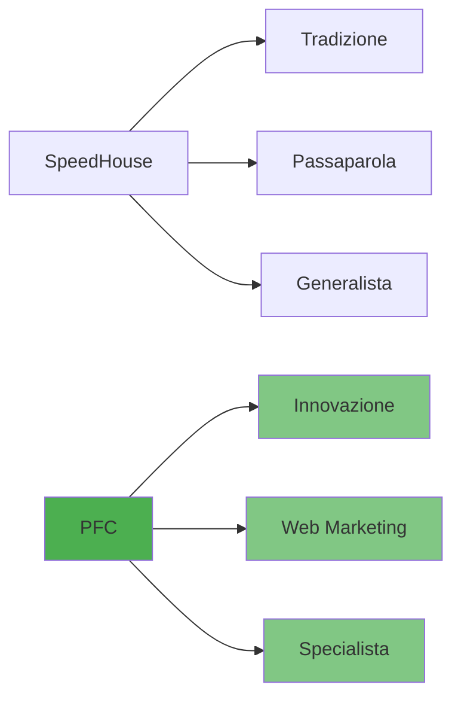

# Analisi dei Competitor Specializzati nel Cartongesso - Lazio

> **Documento di riferimento strategico per PFC – Paolo Fia Cartongesso**  
> Data: Febbraio 2026

---

## Indice
1. [Principali Competitor](#principali-competitor)
2. [Posizionamento SEO](#posizionamento-su-google-seo-locale-e-regionale)
3. [Struttura Siti Web](#struttura-del-sito-web)
4. [Qualità dei Contenuti](#qualità-dei-contenuti)
5. [Strategia Marketing/Branding](#strategia-di-marketing-o-branding)
6. [Localizzazione](#coerenza-con-la-localizzazione)
7. [Ottimizzazione Mobile](#ottimizzazione-mobile-e-tempi-di-caricamento)
8. [Confronto SpeedHouse vs PFC](#confronto-speedhouse-vs-pfc)
9. [Roadmap Strategica](#roadmap-e-posizionamento-strategico)

---

## Principali Competitor

### 1. Cartongesso Roma / ProService Srl (Roma)
- **Siti**: Cartongesso-Roma.it, CartongessoControsoffitti.it
- **Servizi**: Controsoffitti, pareti divisorie, arredi in cartongesso, isolamento termico/acustico
- **Punti di forza**: Struttura web estesa, forte orientamento SEO, pagine dedicate per ogni servizio
- **Strategia**: Pagine per velette, mensole, archi, colonne, listini prezzi, blog

### 2. Controsoffitti SpeedHouse (Ferentino, FR)
- **Specializzazione**: Opere in cartongesso per edilizia civile
- **Storia**: Attiva dal 1992, conduzione familiare (2 dipendenti)
- **Punti di forza**: 30+ anni esperienza, buona reputazione locale
- **Debolezze**: Presenza online limitata (solo Facebook e directory)
- **Slogan**: "La qualità da noi è di casa. Non pensare, osa"

### 3. Comisol Roma
- **Focus**: Isolamento termico/acustico + cartongesso
- **Servizi**: Pareti mobili, controsoffitti, ristrutturazioni chiavi in mano
- **Sito**: comisol-roma.it
- **Punti di forza**: Posizionamento chiaro come "Specialisti del cartongesso e dell'isolamento"

### 4. Aurelia Stucchi (Roma)
- **Storia**: Oltre 50 anni di attività
- **Specializzazione**: Strutture d'arredo e decorative in cartongesso
- **Punti di forza**: Esperienza pluridecennale, showroom visitabile
- **Sito**: Semplice ma funzionale

### 5. RM Controsoffitti (Viterbo)
- **Esperienza**: Oltre 30 anni
- **Area**: Provincia di Viterbo, tutto il Lazio e regioni limitrofe
- **Servizi**: Controsoffitti, fibra minerale, pareti divisorie, isolamenti, insufflaggio
- **Certificazioni**: SOA e ISO
- **Punti di forza**: Gallery fotografica corposa, lavora per enti pubblici

### 6. MG Cartongesso Roma
- **Sito**: mgcartongessoroma.it
- **Approccio**: Fortemente promozionale e orientato al design
- **Servizi**: Controsoffitti, librerie, pareti, decorazioni, cartongesso per uffici
- **Marketing**: Sconto 10% per preventivi online
- **Slogan**: "Lavori a regola d'arte"

### 7. Lavori in Cartongesso Roma
- **Sito**: lavoriincartongesso.it
- **Approccio**: Content marketing e SEO
- **Contenuti**: Guide, FAQ, prezzi indicativi al mq
- **Prezzi indicativi**: Pareti €30-50/mq, Controsoffitti €40-60/mq, Isolamento acustico €40-70/mq

---

## Posizionamento su Google (SEO Locale e Regionale)

### Strategie Osservate

| Strategia | Descrizione | Esempi |
|-----------|-------------|--------|
| **Keyword nel dominio** | Incorporare "Roma" o città nel nome sito | Cartongesso-Roma.it, CartongessoRoma.com |
| **Pagine zone servite** | Elenco dettagliato quartieri/comuni | ProService: zone Roma Nord, Sud, Castelli Romani |
| **Landing locali** | Mini-pagine per singole località | "Cartongesso Pigna", "Librerie Cerveteri" |
| **Contenuti localizzati** | Keyword + località nel testo | "Ditta di Cartongesso a Roma" |
| **Directory locali** | Presenza su Instapro, ProntoPro, PagineGialle | Citazioni NAP coerenti |

### Opportunità per PFC
- **Provincia Frosinone**: SpeedHouse non ha sito → varco per posizionarsi
- **Roma città**: Competizione alta → necessari contenuti di qualità e SEO on-site

---

## Struttura del Sito Web

### Best Practice dai Competitor

```
├── Home
│   ├── Hero con slogan
│   ├── 3 box servizi principali
│   └── CTA preventivo
├── Chi Siamo
│   ├── Storia azienda
│   ├── Team
│   └── Valori/Mission
├── Servizi
│   ├── Controsoffitti
│   ├── Pareti divisorie
│   ├── Isolamento Acustico
│   ├── Isolamento Termico
│   ├── Velette e Decorazioni
│   └── Cappotto interno
├── Gallery / Portfolio
│   ├── Per tipologia
│   └── Prima/Dopo
├── Prezzi (opzionale)
├── Blog / Novità
├── Contatti
│   ├── Form
│   ├── Mappa
│   └── WhatsApp click-to-chat
└── Zone Servite
```

### Elementi Chiave
- **Menu completi e gerarchici**
- **CTA sempre visibili** (telefono, WhatsApp, preventivo)
- **Sezioni FAQ** per SEO e fiducia
- **Form contatto semplici**

---

## Qualità dei Contenuti

### Testi Efficaci
- Linguaggio orientato al cliente
- Vantaggi esplicitati (rapidità, pulizia, versatilità)
- Sezioni "Perché sceglierci" con bullet point
- Dati concreti (es. "abbattimento rumore fino a 50 dB")

### Elementi Visivi
- Foto progetti reali
- Gallery suddivisa per tipologia
- Video timelapse (differenziante)

### CTA e Offerte
- "Preventivo gratuito e senza impegno"
- Sconti per preventivi online (es. MG: 10%)
- WhatsApp per foto e consulenza rapida

### Testimonianze
- Recensioni con nome cliente
- Stelline/rating visibili
- Citazioni specifiche ("finitura impeccabile")

---

## Strategia di Marketing o Branding

### Posizionamenti dei Competitor

| Azienda | Posizionamento | Slogan/Messaggio |
|---------|----------------|------------------|
| SpeedHouse | Qualità artigianale | "La qualità da noi è di casa" |
| Comisol | Specialisti isolamento | "Specialisti del cartongesso e dell'isolamento" |
| Aurelia Stucchi | Tradizione + creatività | "Oltre 50 anni di esperienza" |
| MG Cartongesso | Design e cura | "Lavori a regola d'arte" |
| RM Controsoffitti | Affidabilità certificata | Certificazioni SOA/ISO |

### Opportunità per PFC
Nessun competitor ha puntato fortemente sulle **velette** come elemento di branding → spazio da occupare!

**Proposta**: *"Gli specialisti delle velette luminose e dell'isolamento integrato"*

---

## Coerenza con la Localizzazione

### Elementi Essenziali
- ✅ Indirizzo fisico visibile
- ✅ Numero telefono locale (06 per Roma, ecc.)
- ✅ Google My Business ottimizzato
- ✅ Mappa integrata nella pagina contatti
- ✅ Pagina "Zone servite" con elenco province/comuni

### Azioni per PFC
1. Creare scheda Google Business Profile
2. Iscriversi a PagineGialle, Houzz, Instapro, ProntoPro
3. Coerenza NAP (Name, Address, Phone) ovunque
4. Valutare numeri dedicati per area geografica

---

## Ottimizzazione Mobile e Tempi di Caricamento

### Standard dei Competitor
- Design responsive
- Pulsanti WhatsApp click-to-chat
- Menu hamburger funzionale
- Immagini ottimizzate (lazy loading)

### Checklist Mobile per PFC
- [ ] Design mobile-first
- [ ] Bottoni touch-friendly (min 44x44px)
- [ ] Numero telefono click-to-call
- [ ] WhatsApp integrato
- [ ] Test PageSpeed Insights (obiettivo: >90)
- [ ] Immagini WebP
- [ ] Lazy loading gallery

---

## Confronto SpeedHouse vs PFC

### SpeedHouse - Punti di Forza
| Aspetto | Dettaglio |
|---------|-----------|
| Esperienza | 30+ anni (dal 1992) |
| Reputazione | Consolidata nel territorio |
| Specializzazione | 100% cartongesso |
| Rapporto | Personale/familiare |
| Flessibilità | Preventivi competitivi |

### SpeedHouse - Debolezze
| Aspetto | Opportunità per PFC |
|---------|---------------------|
| No sito web | PFC può dominare online |
| Raggio limitato | PFC può coprire tutto il Lazio |
| No branding nicchia | PFC → specialista isolamento/velette |
| Capacità limitata | PFC con più squadre può gestire più cantieri |
| No prezzi online | PFC → trasparenza sui costi |

### Strategia PFC vs SpeedHouse



---

## Roadmap e Posizionamento Strategico

### 1. SEO Locale e Contenuti
- [ ] Pagine dedicate per ogni servizio
- [ ] Sezione "Zone servite" (Roma, Frosinone, Latina, Viterbo, Rieti)
- [ ] Blog con articoli ottimizzati
- [ ] FAQ per intercettare ricerche specifiche

### 2. Struttura Sito
- [ ] Menu chiaro e completo
- [ ] Hero con slogan + immagine impatto
- [ ] 3 box servizi: Isolamento Acustico, Isolamento Termico, Velette
- [ ] CTA "Preventivo Gratuito" sempre visibile
- [ ] Integrazione WhatsApp

### 3. Contenuti di Qualità
- [ ] Testi professionali orientati al cliente
- [ ] Dati concreti sui benefici
- [ ] Gallery fotografica per categoria
- [ ] Casi studio con prima/dopo
- [ ] Video timelapse (differenziante)

### 4. Offerte e Conversione
- [ ] Offerta lancio (es. sconto primi 10 clienti)
- [ ] Comunicare bonus ristrutturazione 50%
- [ ] Preventivo entro 24h (promessa esplicita)
- [ ] Form semplici

### 5. Local SEO
- [ ] Google Business Profile
- [ ] Directory locali (PagineGialle, Instapro, Houzz)
- [ ] Coerenza NAP ovunque
- [ ] Raccolta recensioni dai primi clienti

### 6. Mobile e Performance
- [ ] Design responsive mobile-first
- [ ] PageSpeed >90
- [ ] Immagini ottimizzate WebP
- [ ] Click-to-call e WhatsApp

### 7. Branding
- [ ] Logo professionale
- [ ] Palette colori coerente
- [ ] Slogan: es. "PFC Cartongesso – Comfort e Design su Misura in Lazio"
- [ ] Pagine social (Facebook, Instagram)

### 8. Monitoraggio
- [ ] Google Analytics
- [ ] Google Search Console
- [ ] Monitoraggio conversioni
- [ ] Test A/B pagine landing

---

## Posizionamento Target per PFC

> **Vision**: Leader emergente nel cartongesso Lazio con forte specializzazione in comfort abitativo e soluzioni estetiche personalizzate

### Parole Chiave del Brand
- Comfort
- Isolamento
- Benessere acustico
- Risparmio energetico
- Design
- Su misura
- Velette luminose

### Target Clientela
- Proprietari di case attenti alla qualità
- Budget medio-alto
- Sensibili al comfort abitativo
- Interessati a soluzioni estetiche moderne

---

## Fonti

Analisi basata su:
- Cartongesso-Roma.it
- Comisol-Roma.it
- AureliaStucchi.it
- RMControsoffitti.it
- MGCartongessoRoma.it
- Lavoriincartongesso.it
- SpeedHouse Ferentino (Facebook, PagineGialle)
